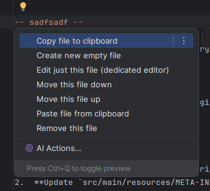
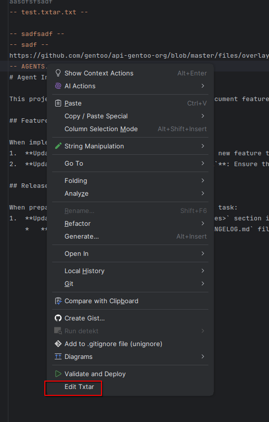
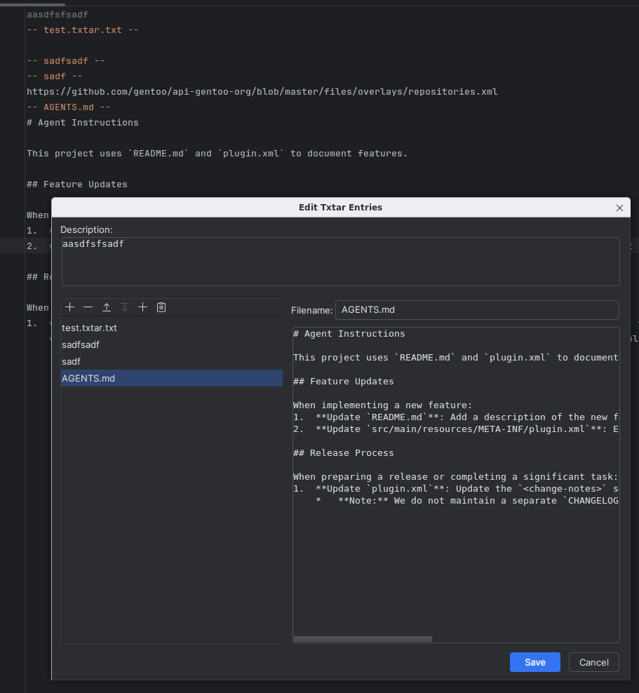
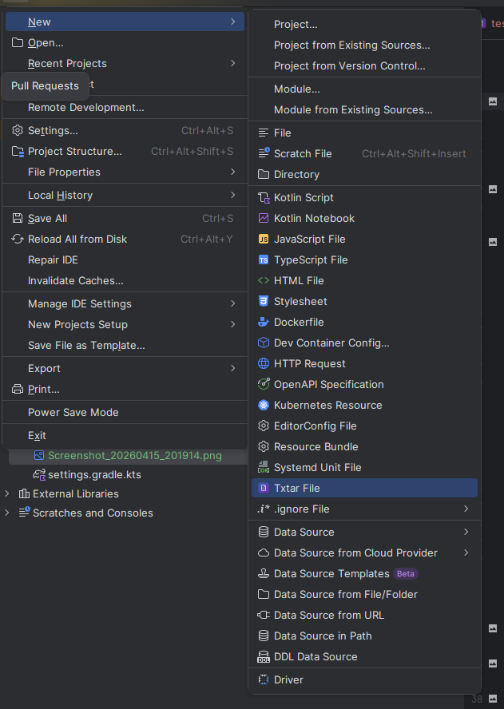

# Txtar

<p align="center">
    
</p>

<p align="center">
    <a href="https://plugins.jetbrains.com/plugin/30286-txtar-file-support">
        
    </a>
    <a href="https://plugins.jetbrains.com/plugin/30286-txtar-file-support">
        
    </a>
</p>

Provides support for the [txtar](https://pkg.go.dev/golang.org/x/tools/txtar) file format.

## Status

The project is currently in active development. Basic support for the `txtar` format has been implemented and the project builds successfully.

## Features

- **File Type Recognition**: Automatically recognizes `.txtar` files.
- **Syntax Highlighting**: Basic syntax highlighting for `txtar` archives.
- **Folding**: Code folding support for file entries in the archive.
- **Editor Actions**:
  - **Edit Txtar**: A unified dialog to manipulate existing Txtar file entries (append, remove, reorder, preview). Available from Editor and Project View context menus.
  - **Calculate File Size**: Calculate the size of the current txtar file.
- **Intention Actions** (Alt+Enter):
  - Edit current file contents.
  - Remove current file.
  - Move file up or down.
  - Edit file description.
  - Copy file to clipboard or paste from clipboard.
  - Create new empty file.
- **Project Actions**:
  - Create new `Txtar File` via the File > New menu.










## Installation

**From Marketplace:**

The project is available on the [Marketplace](https://plugins.jetbrains.com/plugin/30286-txtar-file-support).

**Manual Build:**

To build the project, run:

```bash
./gradlew buildPlugin
```

The archive will be generated in `build/distributions/`. You can then install it via "Install from Disk...".

## Usage

1. Open a `.txtar` file in your IDE.
2. Right-click in the editor to access the "Txtar" context menu.
3. Use the available actions to manage the content of the archive.

## License

This project is licensed under the BSD 3-Clause License - see the [LICENSE](LICENSE) file for details.
